# 🚀 CareerTracker

CareerTracker is a web-based portfolio management system that helps users organize and showcase their professional portfolios, including projects, certifications, skills, organizations, achievements, and work experience.


---

## 📸 Application Preview

### 🔐 Authentication

| Register | Login |
|----------|-------|
| 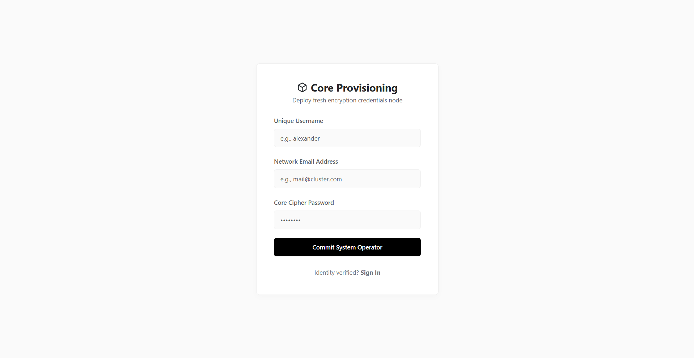 | 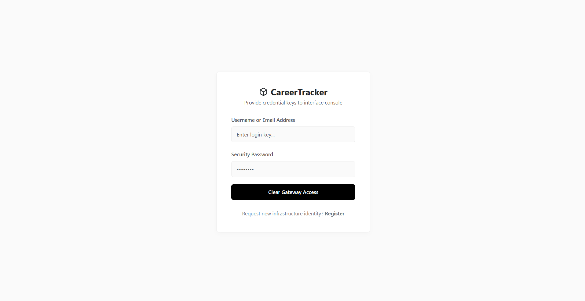 |

---

### 👤 User Interface

| Dashboard | Projects |
|-----------|----------|
| 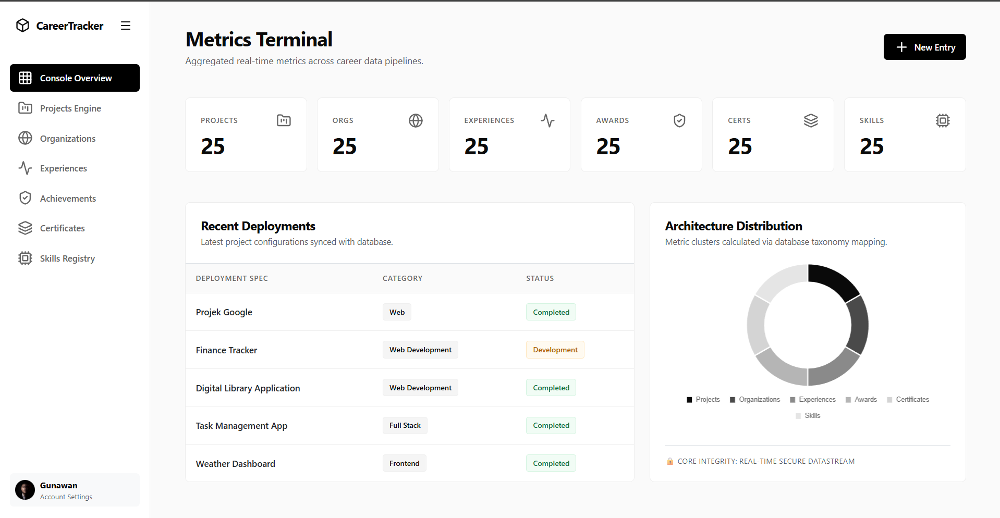 | 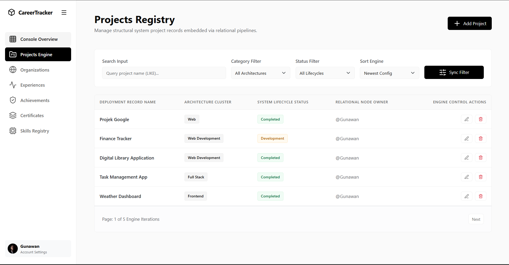 |

| Organizations | Experiences |
|---------------|-------------|
| 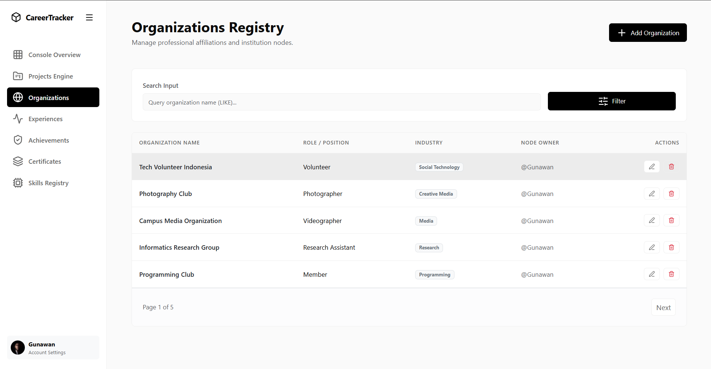 | 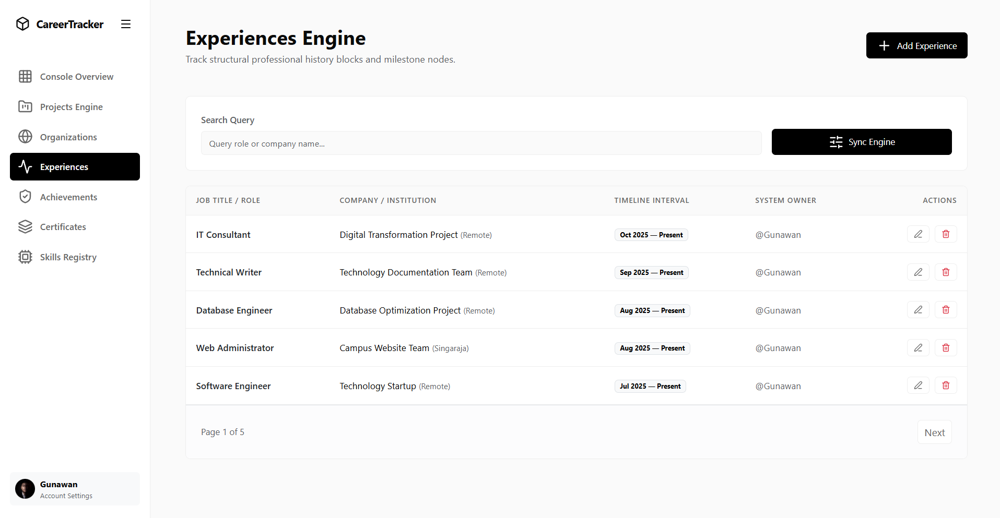 |

| Achievements | Certificates |
|--------------|--------------|
| 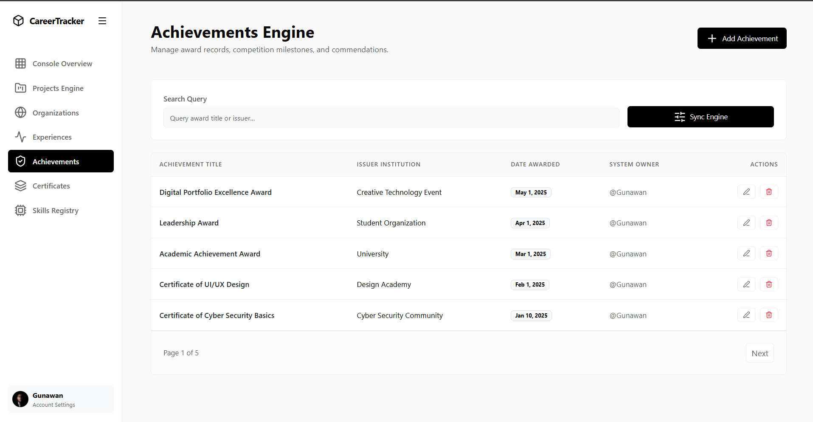 | 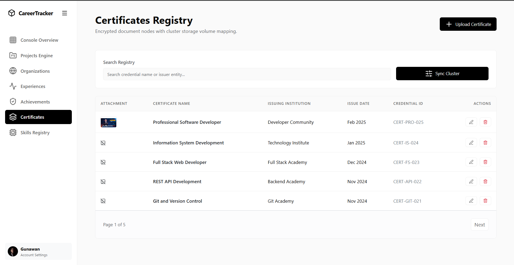 |

| Skills |
|--------|
| 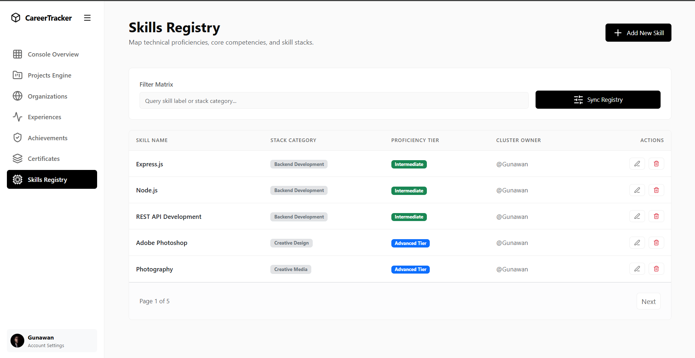 |

---

### 🛠️ Admin Interface

| Register | Login |
|----------|-------|
|  |  |

| Dashboard | Database Information |
|-----------|----------------------|
| 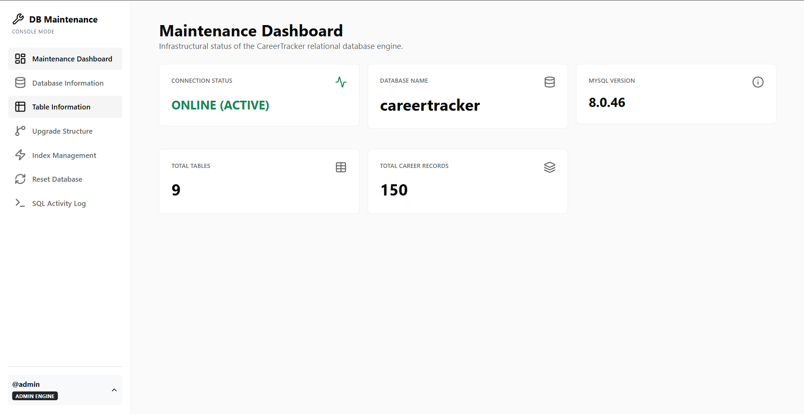 | 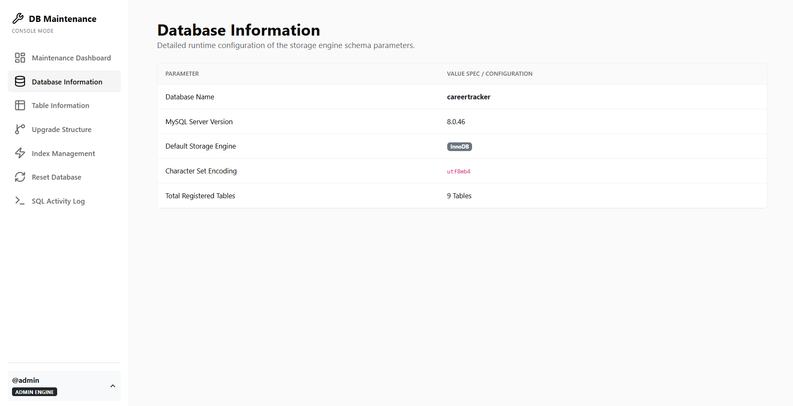 |

| Table Information | Upgrade Structure |
|-------------------|-------------------|
| 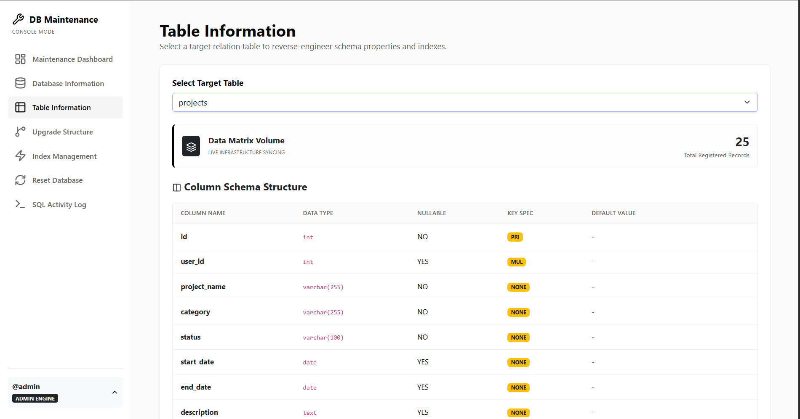 | 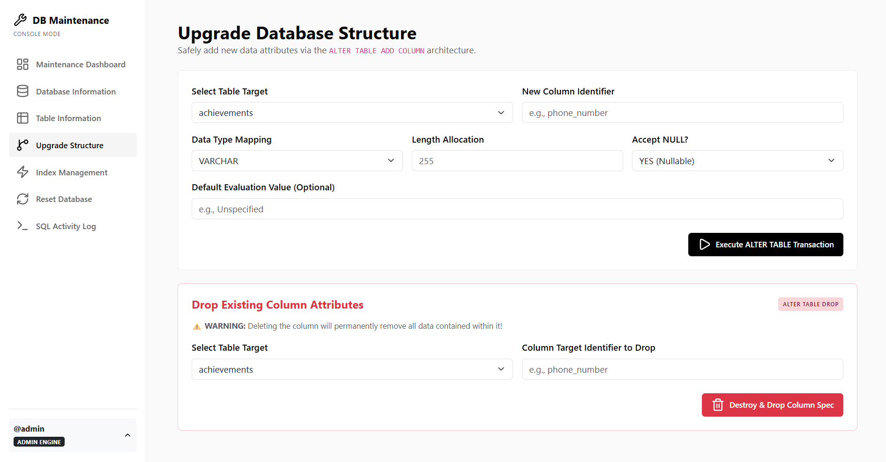 |

| Index Management | Reset Database |
|------------------|----------------|
| 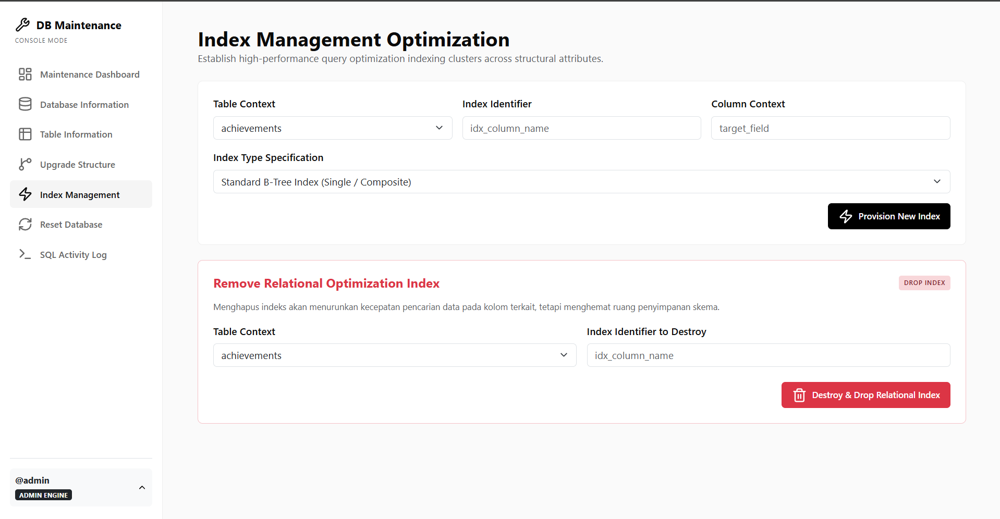 | 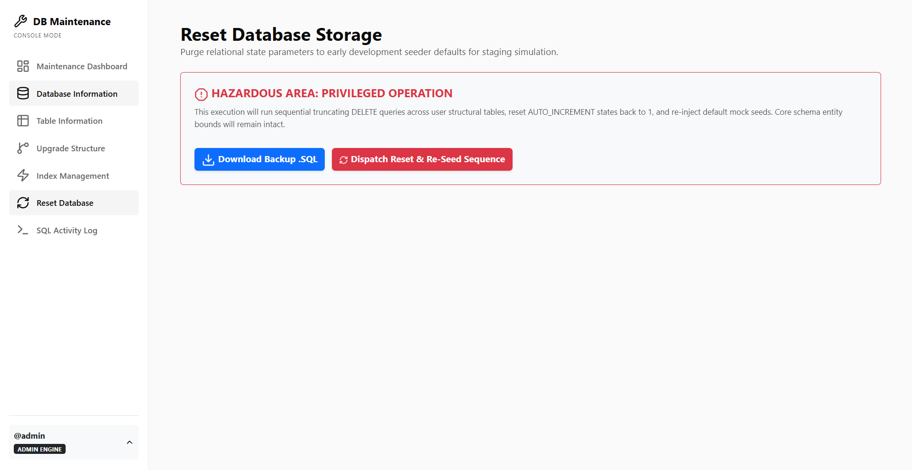 |

| SQL Activity Logs |
|-------------------|
| 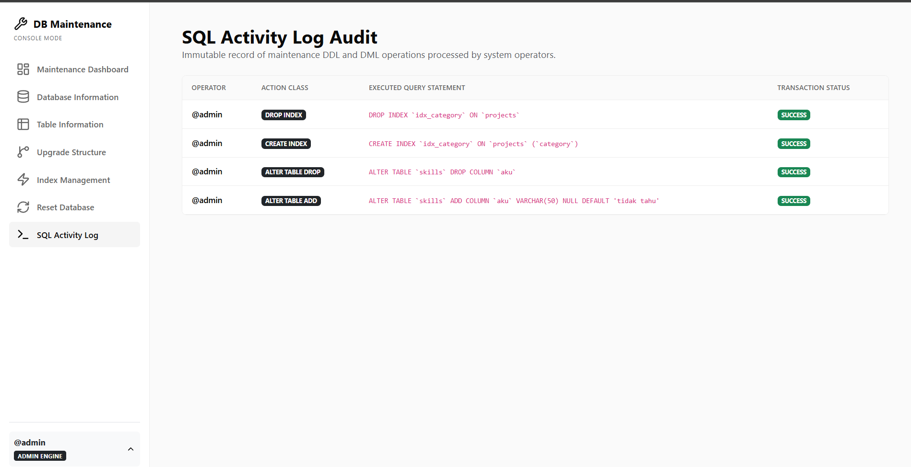 |

---

## 🚀 Features

- User Authentication
- Dashboard
- Project Management
- Certificate Management
- Skills Management
- Experience Management
- Organization Management
- Achievement Management
- Admin Dashboard
- User Management

---

## 🛠️ Technologies

- Node.js
- Express.js
- EJS
- MySQL
- JavaScript
- HTML5
- CSS3
- Docker

---

## 📦 Installation

Install dependencies:

```bash
npm install
```

Configure your `.env` file, then run:

```bash
npm start
```

---

## 📄 Copyright

Copyright © 2026 Gunawan Sutrayasa. All rights reserved.

This project was developed for educational and portfolio purposes. Unauthorized commercial use, reproduction, or distribution without permission is prohibited.

---

## 👨‍💻 Author

**Gunawan Sutrayasa**
